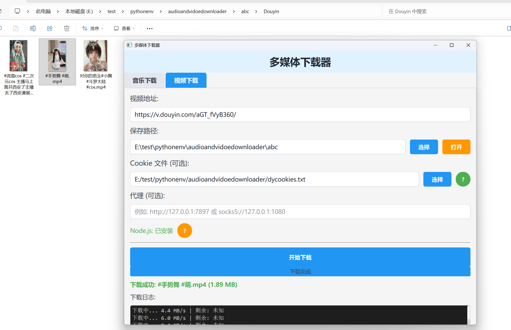
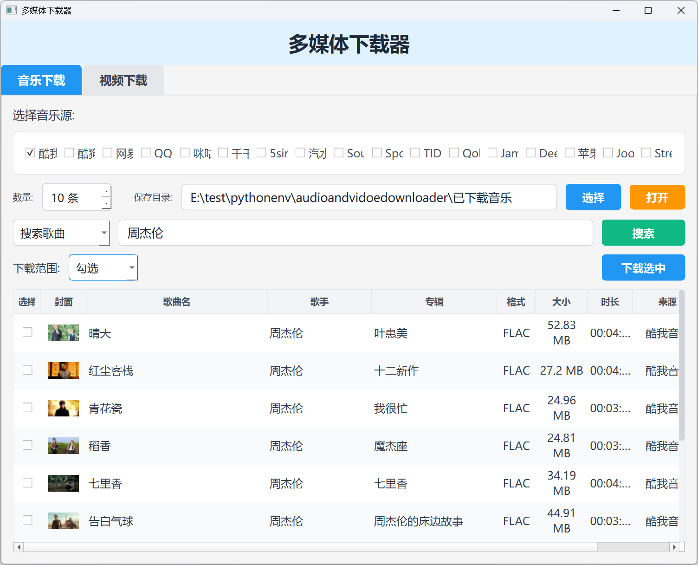

<h1 align="center">音视频下载器</h1>

<p align="center">
  🇺🇸 <a href="./README_EN.md">English</a> | 🇨🇳 <a href="./README.md">简体中文</a>
</p>

<p align="center">
  
  
  
  
</p>

<p align="center">
统一的音乐 + 视频下载器，基于 PyQt6 的 Tab 界面，支持多平台音乐搜索与下载、多平台视频下载。
</p>

---

### 功能特性

#### 音乐下载

- 支持 17+ 音乐平台：酷我、酷狗、网易云、QQ音乐、咪咕、千千、5sing、汽水音乐、SoundCloud、Spotify、TIDAL、Qobuz、Jamendo、Deezer、Apple Music、Joox、StreetVoice
- 支持关键词搜索与歌单链接解析
- 显示专辑封面、歌曲名、歌手、专辑、格式、大小、时长、来源
- 支持表格排序、右键菜单下载、批量下载（勾选/全选/未勾选）
- 自动下载歌词文件（.lrc）
- 支持多音乐源同时搜索

#### 视频下载

- 支持 B站、抖音、小红书、YouTube 等主流平台下载无水印视频
- 平台自动识别，按平台分类保存
- Cookie 文件支持（抖音等需要登录的网站）
- 代理支持（HTTP/SOCKS5）
- Node.js 状态检测与安装引导（YouTube 下载需要）
- 实时下载进度条与速度显示
- 下载日志查看

### 软件截图

<table align="center" border="0" cellpadding="10">
  <tr>
    <td align="center">
      <br>
      <b>音乐下载</b>
    </td>
    <td align="center">
      <br>
      <b>视频下载</b>
    </td>
  </tr>
</table>

---

### 使用教程：

```bash
# 需要用Python3.10+
git clone https://github.com/MrsEWE44/multimediadownloader.git
cd multimediadownloader
python -m venv gqb313
gqb313\Script\Activate.bat
pip install -r requirements.txt
python downloader_gui.py
```

### 打包教程：

```bash
# 先完成上面的环境搭建步骤，然后安装 PyInstaller
pip install pyinstaller

# Windows 系统，运行 make_release.bat
.\make_release.bat

# Linux / MacOS 系统，运行 make_release.sh
bash make_release.sh
```

打包完成后，`dist/` 目录下会生成：
- `downloader_gui.exe` — 无窗口版本（双击运行）
- `downloader_gui_debug.exe` — 带控制台版本（方便调试）

### Cookie 获取方法

1. 在 Chrome 浏览器安装扩展：[Get cookies.txt LOCALLY](https://chrome.google.com/webstore/detail/get-cookiestxt-locally/cclelndahbckbenkjhflpdbgdldlbecc)
2. 打开目标网站并登录
3. 点击浏览器工具栏的扩展图标
4. 点击 "Export" 保存为 `.txt` 文件
5. 将文件路径填入 Cookie 输入框

### 常见问题

| 问题 | 解决方案 |
|------|---------|
| YouTube 下载失败 | 需要安装 Node.js >= 22，官网: https://nodejs.org/ |
| 抖音下载失败 | 需要提供 Cookie 文件 |
| Bilibili 视频音视频分离 | 需要安装 ffmpeg 进行合并（可选） |
| 海外网站下载慢 | 配置代理（如 `http://127.0.0.1:7897`） |

### 致谢

- [musicdl](https://github.com/CharlesPikachu/musicdl) - 音乐下载核心
- [yt-dlp](https://github.com/yt-dlp/yt-dlp) - 视频下载核心
- [PyQt6](https://pypi.org/project/PyQt6/) - GUI 框架
